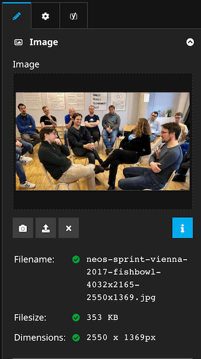
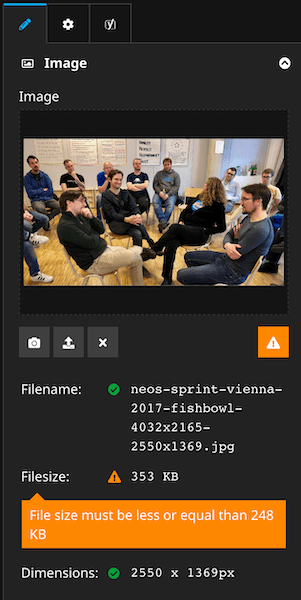

# Image editor plugin with additional checks for Neos CMS

This package provides a Neos CMS plugin which extends the default Neos image editor with additional checks for the 
selected image. It supports global and individual configurations for each image type.

## Installation

Add the plugin as dependency to your Neos CMS project:

    composer require shel/neos-image-checker

## Examples

### Example with all checks passing

[](Documentation/imagechecker-valid.png)

Note: the details are not shown by default and can be toggled by clicking on the "i" button.

### Example with some checks failing

[](Documentation/imagechecker-invalid.png)

Note: the details are shown in this case by default and can be toggled by clicking on the "alert" button.

## Configuration

After installation the default image editor in your Neos installation is replaced by the one from this package.
The additional functionality only wraps the provided Neos image editor, so it doesn't contain the editors code
and in most cases supports updating the Neos UI without needing updates for this plugin.

### Global settings

Global defaults for each image editor

```yaml
Neos:
  Neos:
    Ui:
     frontendConfiguration:
      'Shel.Neos.ImageChecker:ImageChecker':
        enabled: true # allows disabling the checks for all image properties
        defaults:
          fileSize:
            default: 2048
            svg: null
            png: null
            jpg: null
          fileDimensions:
            maxWidth: null
            maxHeight: null
            minWidth: null
            minHeight: null
          fileName:
            allowedPattern: '^[0-9a-zA-Z_\-.]+$'
```

### Individual settigns

For each image property of a nodetype you can override single or all of the following settings:

```yaml
My.Vendor:My.NodeType:
  properties:
    image:
      type: 'Neos\Media\Domain\Model\ImageInterface'
      ui:
        label: 'Some image'
        reloadIfChanged: true
        inspector:
          group: image
          editorOptions:
            features:
              imageCheck: # optional overrides
                fileSize: # in kb
                  default: 2048 # optional
                  svg: 100 # optional
                  jpg: 2048 # optional
                  png: 2048 # optional
                fileDimensions: # in px, only affects jpg and pngs
                  maxWidth: 500
                  maxHeight: 300
                fileName: # matches the filename without extension
                  allowedPattern: '^[a-z]+$'
```

## License

See [License](LICENSE.txt)
